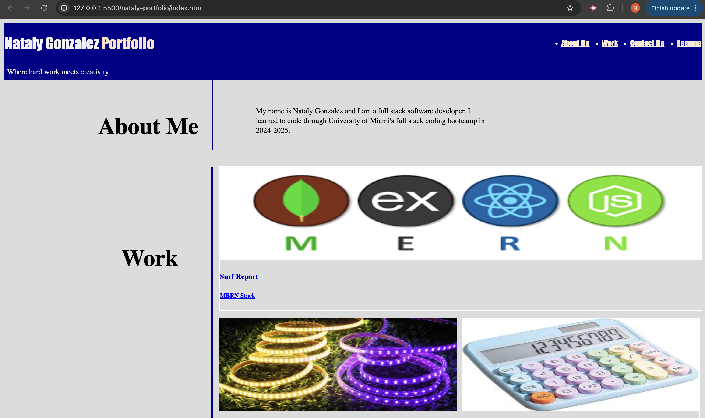
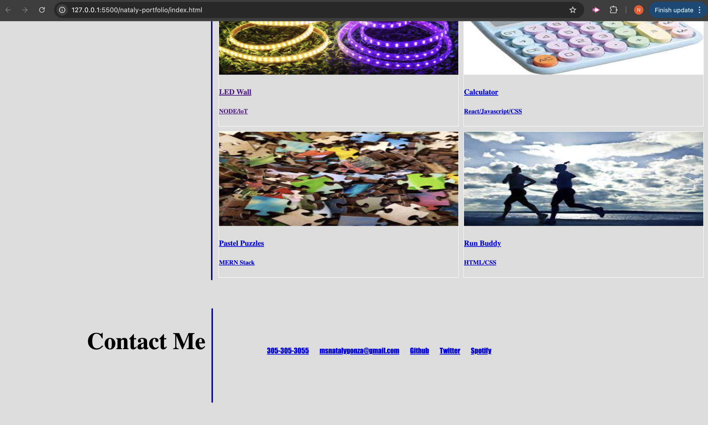

# nataly-portfolio

## Description

The goal of this challenge was to create a portfolio of my professional work. I needed to create a website with my name, a recent photo, links to sections about me, my work and how to contact me. When you lcick one of the links in the navigation, the UI scrolls to the corresponding section. When tou click on the link to their section about their work then the UI scrolls to a section with titled images of my applications. When presented with my first application, the image should be larger in size than the others. When you click on the images of the applications, you will be taken to the deployed application. When you resize the page or view the site on various screens and devices, you are presented with a responsive layout that adapts to the viewer's viewport.

## Screenshot

## Link to working Application
<a href="https://namastenataly.github.io/test-challenge/">Github Pages</a>
